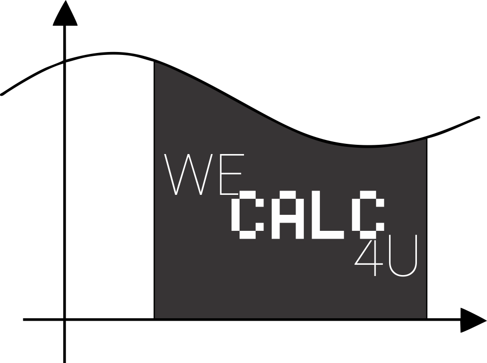

<h1 align="center">
    
</h1>

## Tecnologias

- [C](https://devdocs.io/c/)

## Objetivo do Projeto

Uma simples calculadora em C que realiza cálculos de funções, derivadas e integrais.
O projeto foi feito sob encomenda para um trabalho da faculdade, mais especificamente para a matéria de Cálculo.

## Como Utilizar

Para utilizar a aplicação, você precisará do [Git](https://git-scm.com) instalado no seu computador.

Utilizando a linha de comando:

### Baixando o projeto
```bash
# Clone o repositório
$ git clone https://github.com/AzraelGarden/wecalc4u/

# Entre no repositório
$ cd wecalc4u

# Execute o main.exe.
```

